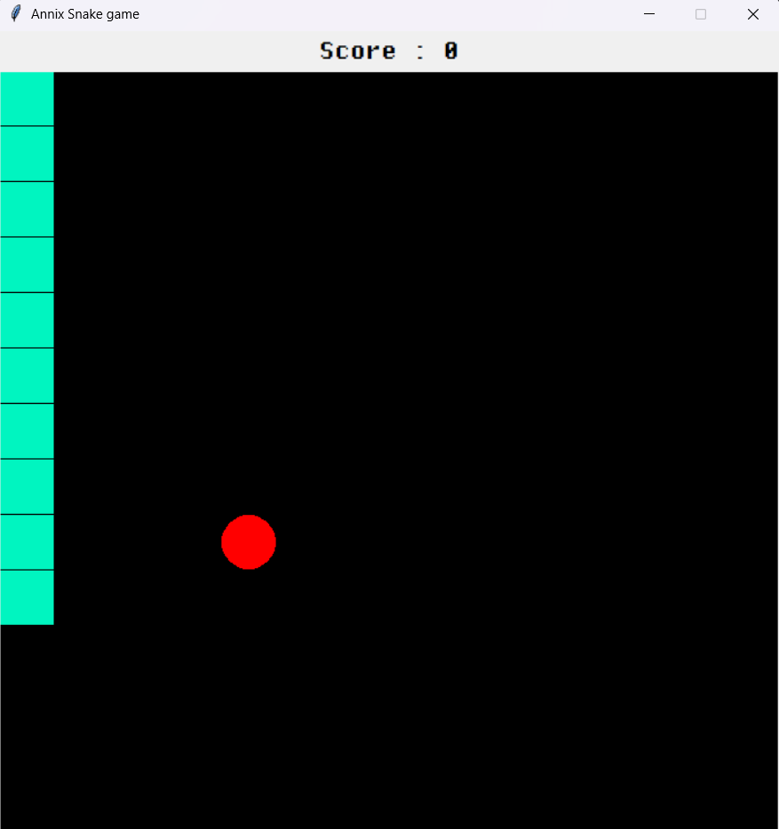
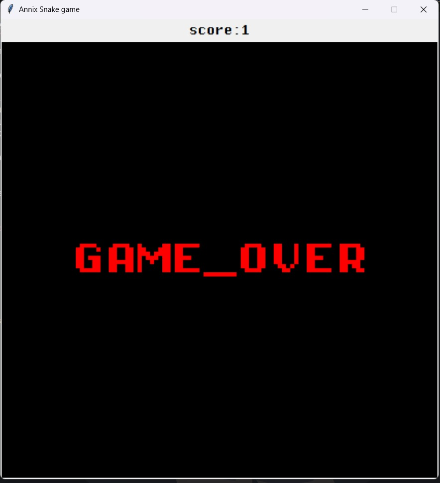

# **🐍 Snake Game - using Python**
Welcome to my version of the classic Snake Game built using **Python** and **Tkinter**! 🎮
### Created by: **Anonixli (Manuja Demin)**

---

## 🎮 **About the Game**
This is a simple and fun implementation of the Snake Game, where the player controls the snake to eat food while avoiding collisions with the walls and its own body. The snake grows with each food it eats, and the score increases accordingly. 

---

## 🚀 **Features**
- **Classic Gameplay**: Control the snake using arrow keys.
- **Score Tracking**: A live score display updates as you play.
- **Collision Detection**: Game ends if the snake hits a wall or itself.
- **Customizable Colors**: Choose your own snake, food, and background colors.
- **Responsive Design**: Runs smoothly on all systems.

---

## 📸 **Screenshots**

### Game Window Example 1:

### Game Over Screen Example:

---

## 🛠️ **Technologies Used**
- **Python 3**
- **Tkinter** (for the graphical interface)
- **Random Library** (for food placement)

---

## ✨ **Customization**
You can easily modify the following values in the code to personalize the game:
- **Game Speed**: `SPEED` variable.
- **Colors**:
   - Snake Color: `SNAKE_COLOR`
   - Food Color: `FOOD_COLOR`
   - Background Color: `BG_COLOR`
- **Game Dimensions**: `GAME_WIDTH` and `GAME_HEIGHT`.

---
## 🙌 **Acknowledgements**
Thanks to the Python community and open-source enthusiasts for inspiring me to create this game.

---

### **Made with ❤️ by Anonixli (Manuja Demin)**

